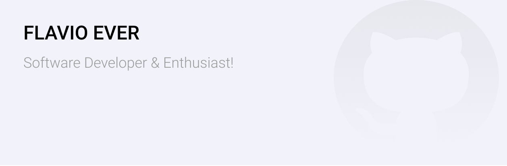

<!--### Hi there 👋

**flavio-ever/flavio-ever** is a ✨ _special_ ✨ repository because its `README.md` (this file) appears on your GitHub profile.

Here are some ideas to get you started:

- 🔭 I’m currently working on ...
- 🌱 I’m currently learning ...
- 👯 I’m looking to collaborate on ...
- 🤔 I’m looking for help with ...
- 💬 Ask me about ...
- 📫 How to reach me: ...
- 😄 Pronouns: ...
- ⚡ Fun fact: ...
-->

<!-- section - header -->

# Hi, I'm Flavio Ever 👨‍💻

I'm a software developer and enthisiast. The technologies i like working with Stack (ReactJs, ReactNative and NodeJs) 🦄. My principle is the secret to success is to start before you are ready. I like to discuss design patterns, architectures, UI/UX and in my spare time talking about Elon Musk (Tesla, Starlink, SpaceX) haha

<!-- section - Me -->

## Follow me 🌎

💼 My profile <a href="https://www.linkedin.com/in/flavio-ever/">LinkedIn</a>

📖 My articles <a href="https://medium.com/@flavio.ever">Medium</a>

<!-- section - skills -->

## I work on 💻

> React.js, React Native, Microservices, AWS, Docker

> Postgresql, MongoDB, RabbitMq

> JavaScript, VBNET, Java
